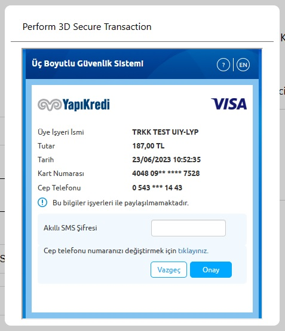
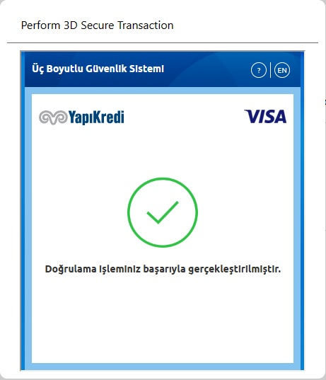

#### WooMendo Nedir
> WooMendo WooCommerce içerisine ödeme yöntemi olarak [Paymendo'yu](https://www.paymendo.com/) entegre eden bir Wordpress eklentisidir
> Kulanıcı kredi kartı bilgileri ile paymendo üzerinden ödeme yapılabilir
> Woocmmerce içerisinde Paymendo üzerinden yapılacak ödeme WooMendo aracılığı ile gerçekleştirilir

#### Paymendo Nedir
>  [Paymendo](https://www.paymendo.com/) bir sanal pos tahsilat uygulamasıdır
>  [Paymendo](https://www.paymendo.com/) üzerinden ödemeler farklı sanal poslara yönlendirilebilir

---

#### Kullanım
1. WooMendo eklentisi kurulur ve etkinleştirilir 
2. WooCommerce ödeme ayarlarına girilir ve WooMendo etkinleştirilir
3. Site sahibi kendisine verilen oturum bilgilerini WooMendo ayarlarında ilgili alanlara girip kaydeder
4. Sipariş oluşturulurken ödeme yöntemi olarak WooMendo seçilir

Wordpress üzerinde hali hazırda WooCommerce kurulu olmalıdır
WooCommerce Ödeme Ayarları = Woocommerce > Settings > Payments
WooMendo Ayarları = Woocommerce > Settings > Payments > WooMendo

---

#### WooMendo Ayarları
| Alan | Açıklaması |
|----|----|
|Enable / Disable | Eklentinin aktif olup olmadığını gösterir.|
|Title|Eklentinin başlığıdır, ödeme ekranında gözükür.|
|Description|Eklentinin açıklamasıdır, ödeme ekranında gözükür.|
|Login e-mail|Paymendo tarafında oturum açabilmek için gerekli mail adresidir.|
|Login password|Paymendo tarafında oturum açabilmek için gerekli olan parola bilgisidir.|
|BASE API URL|Paymendo tarafında atılacak istekler için varsayılan temel bağlantı URL'idir|

---

#### WooMendo Dizin ve Dosyaları
Woomendo eklentisi ana dizini içerisinde " PaymendoRequest_class.php ", " WooMendo_init_gateway_class.php " ve " woomendo.php " adlı 3 php dosyası ile " creditCard "  ve " lang " adlı 2 dizin bulunmaktadır. " lang " dizini Türkçe - İngilizce çeviri dosyasını tutarken " creditCard " dizininde kredi kartı ile alakalı JavaScript, css ve php dosyaları ile genel javascript dosyam bulunmakta.

##### woomendo.php
Bu dosya eklentinin ana dosyasıdır ve görevleri şu şekildedir:
* Eklentiyi Wordpress'e ve WooCommerce'ye tanıtır
* İçerisindeki " make_payment_control_action " fonksiyonu ile ödeme ilgili siparişin ödemesi alındıysa bunu woocommerce tarafına yansıtır
* İçerisindeki " paymendo_session_return " fonksiyonu ile PHP tarafından JavaScript tarafına veri taşır. Bu fonksiyonun kullanılma sebebi müşterinin kendi özel ödeme sayfasında kredi kartı bilgilerini PHP tarafına almak istemediğimizdendir bunun yerine çeşitli bir kaç veriyi javaScript tarafına taşırız

##### WooMendo_init_gateway_class.php
Bu dosya " woomendo.php " dosyasında WooCommerce'ye ödeme yöntemi olarak tanıttığımız dosyamızdır. 
* WooMendo eklentisinin WooCommerce tarafında karşılık bulduğu kısmıdır. 
* İçerisindeki " WC_WooMendo_Gateway " sınıfı yine WooCommerce'nin " WC_Payment_Gateway " sınıfından türer.
* " WC_WooMendo_Gateway " sınıfımızın içerisinde çeşitli metotlar ve construct yapısı bulunur ve bu yapıların görevleri şu şekildedir:
    *    __construct : Sınıfın kurucusu olarak temel varsayılan ayarlamaları yapar
    *    init_form_fields : 2 başlık önce anlattığım " WooMendo Ayarları " buradan türemektedir, ödeme yönteminin ayarlarının kendi sayfasındaki karşılığıdır.
    *    payment_fields : Ödeme ekranında WooMendo ödeme yöntemi seçildiğinde kullanıcının göreceği yapı burada render edilir, ben burada kredi kartını render etmekteyim.
    *    payment_scripts : Eklenti ile alakalı javaScript ve CSS dosyalarını Wordpress'e tanıtır, aynı zamanda İngilizce - Türkçe çeviri için javaScript tarafına biraz müdehale ederim bu metotta. 
    *    process_payment : Sipariş oluştura basıldıktan sonra olan olayların hazırlanıp kurgulandığı metottur. Bu metot içerisinde WooCommerce tarafında oluşturulan sipariş Paymendo API tarafında da oluşturulur ve akabinde ödeme yapılmaya çalışılır. Eğer bilgilerde yanlışlık varsa kullanıcı daha sonra kendi ödeme sayfasından ödeme sağlayabilir.

##### PaymendoRequest_class.php
Bu dosya WooMendo'nun Paymendo tarafına attığı istekleri yönetir. İçerisinde bulunan " PaymendoRequest " sınıfı Paymendo ile alakalı endpointleri, API ile alakalı bilgileri ve " WooMendo Ayarları " kısmında anlattığım ayarlardan bir kısmını kullanarak istekleri yönetmem sağlar. İçerisindeki metotlar:
* loginWithPassword : Paymendo tarafında oturum açıp erişim şifresi alıp o şifreyi kaydetmek için kullandığım metot.
* createOrder : Daha öncesinde elimde olan erişim şifresi ile Paymendo tarafında sipariş oluşturmamı sağlar.
* getOrderToken : Paymendo tarafında ödeme yapabilmek için javaScriptten attığım ödeme isteğinde kullanmam için gerekli olan siparişin özel erişim şifresini almamı sağlar. Bu isteği " woomendo.js " içerisinde atıyorum.
* getWoomendoAccessToken : " loginWithPassword " metodu ile aldığım erişim şifresini ihtiyacım olan yerlerde bana getirir. Eğer bahsi geçen erişim şifresinin ömrü dolduysa veya bir şekilde bozulduysa kendi içerisinde " loginWithPassword " metodunu çağırıp login olup yeni erişim şifresini döner.
* requestWoomendo : Yukarıdaki metotların içerisinde atılan istekler bu metot üzerinden atılır, genel bir istek şablonudur. Duruma göre Wordpress'in istek atma fonksiyonlarından " wp_remote_post " veya " wp_remote_get " gibi davranır.

##### woomendo.js
Bu dosyada ödeme ile alakalı javaScript kodları bulunur. Önemli gördüğüm kısımlar :
* WooCommerce siparişin ilk oluşturulduğu " checkout " sayfasında siparişi oluşturduğumuzda WooCommerce bir ajax isteği atıyor, biz ise bu ajax isteği sonlandığında ajax isteklerinin kendisine ait olarak tetiklediği eventlerden " ajaxComplete " eventini yakalayıp modal açıyoruz ve ödeme işlemleri için javaScript tarafında istek atıp 3D secure ekranına geçiş yaptırıyoruz.
* Önceki maddede anlattığım işlem başarısız olursa yinede hem WooCommerce hemde Paymendo tarafında sipariş ödenmemiş olsada oluşturuluyor ve ödeme bekliyor. Müşteri kendi özel sayfasından girip tekrar ödeme yapmak istediğinde ise yine önceki maddede bahsettiğimiz ajax isteği gerçekleşmediğinden sayfadaki " Place Order " butonunu ödeme yöntemlerinden WooMendo seçili ise submit eventinde yakalayıp önceki maddedeki ödemeyi sağlıyoruz. 
* Önceki iki maddede de finalde bir modal içerisinde bankadan bize 3D Secure için bir HTML Form dönüyor ve bu form banka ile haberleşiyor. Bu form ile yaptığımız işlem neticesinde bize dönüş olarak javaScriptte " message " eventi gönderiyor. Bizde bu eventi dinleyerek ödeme başarılı veya başarısız olduğunda modal içerisinde çıktı veriyor ve başarılı ise başarılı sayfasına yönlendiriyoruz.

##### woomendo_credit_card_class.php
Bu dosyada kredi kartının ön yüzünü render edebilen bir metoda sahip " CreditCard " adında bir sınıf mevcut. 
Bu sınıfın tek görevi kredi kartını " WooMendo_init_gateway_class.php " içerisindeki " WC_WooMendo_Gateway " sınıfının " process_payment " metodunda kredi kartını render etmektir.

##### woomendo_credit_card.js ve woomendo_credit_card.css
Kredi kartının ön yüzü ile alakalı javaScript kodları ve CSS stillendirmelerini içerirler.

---

#### Öğrendiklerim ve Kazanımlarım
1. Türkçe/İngilizce çeviri için .pot veya .po uzantılı dosyayı subversion ile çektiğimiz paket içerisindeki yapı ile otomatik oluşturup daha sonra poedit ile çevirini yapmak.
2. Bir API'den cevap olarak gelen HTML Formu bir iframe içerisine gömüp oradan işlem yaptırmak ve bu formdan dönen " message " eventine göre işlem yaptırmak.
3. Daha öncesinde " event.preventDefault() " hakkında biraz bilgim olduğunu düşünüyordum ama hiç kullanmamıştım, aslında ne işe yaradığını bu eklentiyi geliştirmeye çalışırken anladım. Bu kod ilgili elementin normal akışta yapacağı işlemleri engelleyip önüne benim yazdığım kodların geçmesini sağlıyor.
4. Token'lar ile önceki eklentide de uğraşmıştım ama bu eklentide iyice oturduğunu düşünüyorum.

---

#### Görseller

